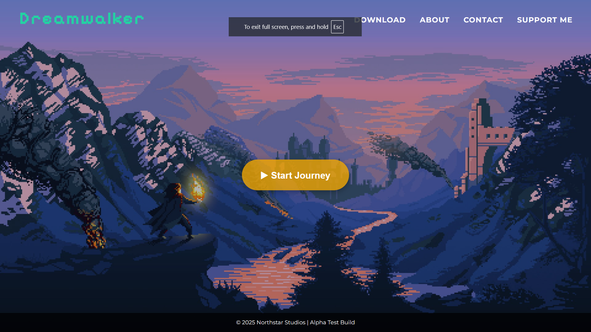

## 🌟 Preview

Dreamwalker: The Last Journey - Landing Page

📌 Project Overview

Dreamwalker: The Last Journey adalah proyek landing page untuk game fiktif dengan konsep 2D pixel art. Proyek ini awalnya mau dibuat pada semester 2 sebagai bagian dari eksplorasi saya dalam game development.

✨ Features

Navigasi Sederhana: Menu navigasi dengan link menuju download, about, kontak, dan support.

Logo Custom: Menggunakan font "Pixelify Sans" untuk tampilan retro.

Background Cinematic: Menggunakan gambar latar dengan efek overlay.

Tombol Interaktif: Tombol "Start Journey" yang dapat memainkan/menghentikan musik tema.

Audio Support: Musik latar yang dapat dimainkan langsung dari halaman.

Responsive Design: Tampilan yang menyesuaikan berbagai ukuran layar.

🛠️ Tech Stack

HTML: Struktur utama website.

CSS: Styling dan animasi UI.

JavaScript: Menangani interaksi pengguna seperti pemutaran audio dan alert message.

🚀 Setup & Running

Clone repository atau download file source.

Pastikan file berikut ada dalam folder:

index.html

style.css

script.js

img/2d.jpg (gambar latar)

audio/xDeviruchi_TakeaRest.wav (musik tema)

Buka index.html di browser untuk melihat hasilnya.

📌 Future Improvements

Menambahkan animasi pada navigasi.

Implementasi efek parallax pada background.

Membuat halaman "About" dan "Support Me" yang lebih interaktif.
